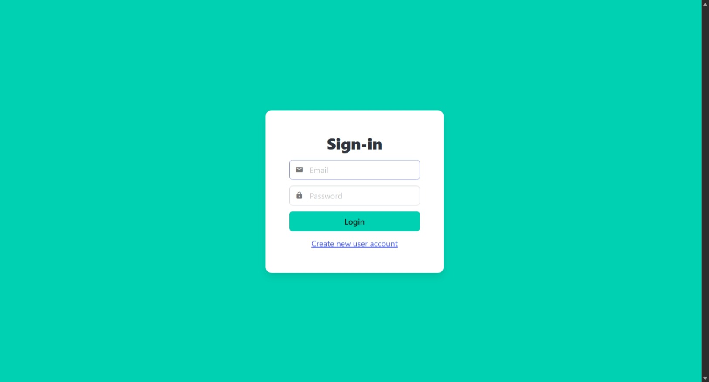
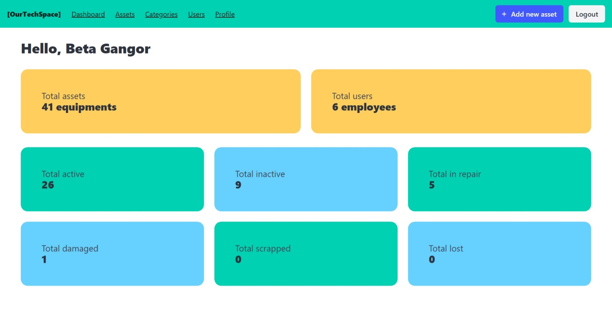
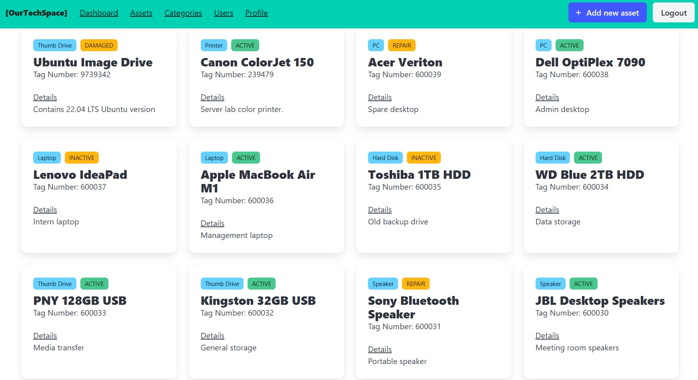
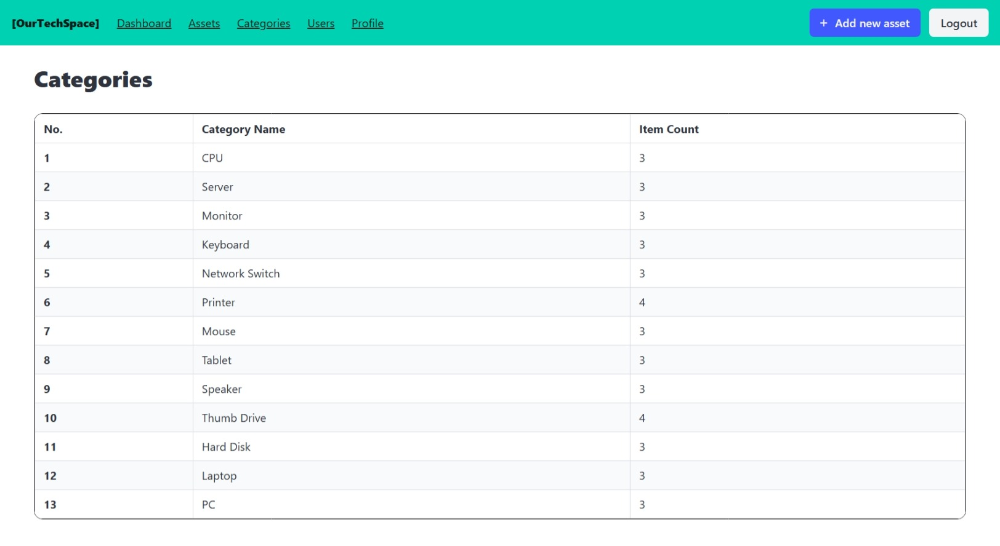
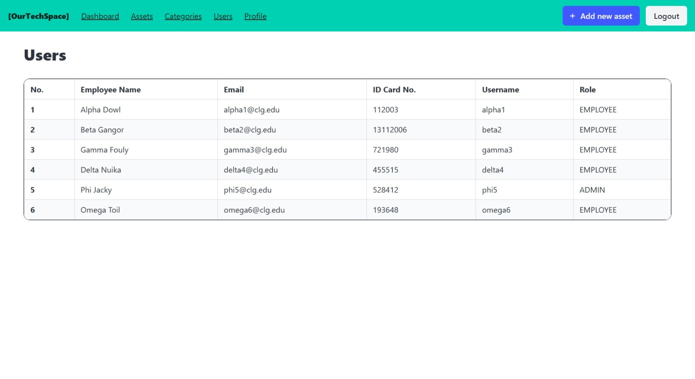
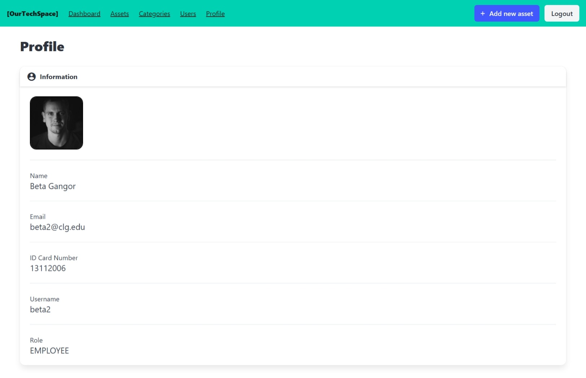

# [OurTechSpace]
A simple invetory system made using Spring Boot, Vue (with typescript) and PostgreSQL.

`elecSpace\elecSpace` contains the backend data. 

`elecSpaceFrontend` contains the frontend data.

## Running
- Backend runs at `localhost:8080`

- Frontend runs at `localhost:5173`

## Screenshots
 
 
  
